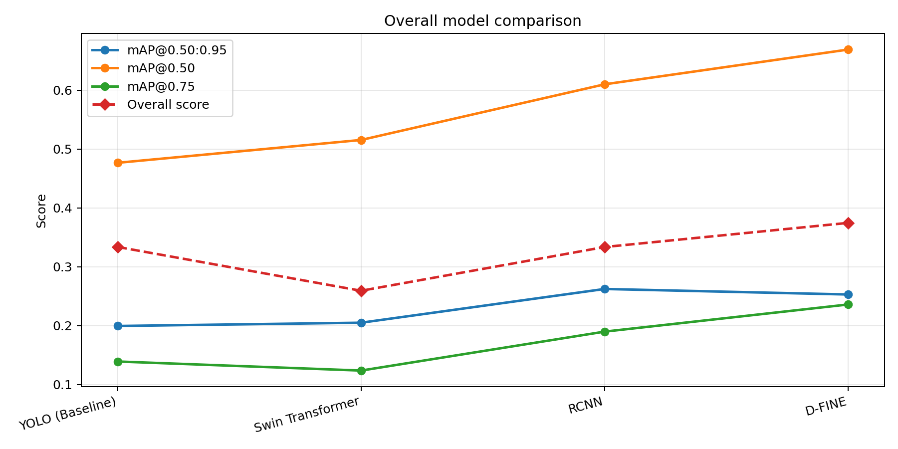

```{=latex}
\newpage
```

# Introduction


## Context


As a ride-sharing company, Uber Technologies Inc. has a responsibility to ensure the safety of its riders, drivers, and the broader public while operating in complex urban traffic environments. As Data Scientists within Uber’s Safety Analytics division, this analysis was conducted to inform the Director of Safety and Driver Operations, whose role is to oversee driver compliance programs, incident reduction efforts, and safety technology strategy at scale. This work evaluates whether a modern computer vision model can reliably detect traffic signs and traffic lights in urban dashcam footage, addressing a critical gap in Uber’s current ability to automatically assess driving context. The objective is to determine whether such a perception system can achieve sufficient accuracy and credibility to support downstream safety applications such as trip auditing, real-time driver alerts, and post-incident analysis.


## Response to Feedback
Following the Progress Update, we implemented several substantive changes in direct response to feedback regarding dataset scale, generalizability, and evaluation credibility.


First, we replaced COCO with the BDD100K dataset and constructed a random 10,000-image working subset for training and evaluation. This shift improves both scale and domain relevance: BDD100K contains over 100,000 images of real-world dashcam footage, allowing us to work with a larger and more representative sample of urban driving environments compared to the general-purpose imagery in COCO.


Second, we explicitly addressed data leakage concerns. All of our chosen models (YOLO, R-CNN, Swin Transformer, and D-FINE) were pretrained on COCO, so continuing to evaluate on that dataset would have weakened the credibility of the comparison. Moving to BDD100K provides a cleaner evaluation setting and enables more defensible performance assessment.


Third, this transition allows for more meaningful model tuning under realistic conditions. Because BDD100K reflects “in-the-wild” traffic scenarios, it supports evaluation under the types of variability such as lighting, occlusion, and scene complexity that are central to the intended deployment setting.


Fourth, we refined the model comparison framework so that models are assessed not only on predictive accuracy, but also on deployment relevance. Specifically, we evaluate held-out test-set detection performance alongside inference speed, reflecting the need for safety systems to balance correctness with operational feasibility.


Finally, we narrowed the business objective. Rather than attempting to directly assess driver compliance, the analysis now focuses on whether reliable detection of traffic signs and lights can be done which can then serve as a credible first-stage input for downstream Uber safety systems.


We deliberately did not extend the scope to video-level temporal modeling or production deployment, as these represent downstream applications built on top of the core perception task addressed in this study. The current work focuses on establishing whether traffic signs and traffic lights can be detected reliably and consistently in dashcam imagery, which is a prerequisite for any higher-level reasoning about driving behavior or real-time intervention systems. As such, these directions are best understood as subsequent layers in a broader safety pipeline, and it is necessary to first demonstrate that the underlying detection problem can be solved with sufficient accuracy and robustness before evaluating or justifying these more complex extensions.


# Abstract


## Executive Summary
This analysis evaluates whether computer vision models can reliably detect traffic signs and traffic lights in urban dashcam imagery to support downstream safety analytics. The objective is to assess the feasibility of a foundational perception layer that can enable future safety tooling. A 10,000-image subset of the BDD100K dataset was used to train and evaluate four models: YOLO, Swin Transformer, Faster R-CNN, and D-FINE. Models were compared on detection accuracy (mAP) and inference efficiency using a consistent held-out test set. Results indicate that the detection task is feasible under realistic driving conditions. D-FINE provides the strongest overall balance of accuracy and speed. Overall, performance across models demonstrates that reliable detection of traffic-control objects is achievable at a level suitable for further development.The results of this study showcase that traffic sign and traffic light detection is reliably achievable in real-world conditions, which can serve as the foundation for improving Uber’s road safety systems through automated trip auditing, incident analysis, and real-time driving context awareness.


## Business Value


The value of this analysis stems from its validation of the core project objective, demonstrating that modern computer vision systems can reliably detect critical traffic-control objects in real-world dashcam imagery. By systematically evaluating multiple state-of-the-art model families under a consistent experimental framework, the study provides evidence that this perception task is feasible and sufficiently robust to support further development. Beyond immediate model performance, the findings have longer-term implications for improving user safety by establishing a foundational capability for understanding driving context at scale. This enables future safety systems that can support automated trip review, improved incident analysis, and the eventual development of real-time safety interventions.


# Methodology


## Data Collection and Integration


### Data Source and Preparation


We used BDD100K, a large-scale driving dataset composed of real street-level dashcam photos from New York, San Francisco, Berkeley, and the Bay Area [@yu2020bdd100k]. After locally downloading the full BDD100k dataset, we randomly selected a 10,000-image working subset, referred to here as BDDK10k, to make training and comparison more computationally feasible. The analysis focused on two safety-relevance target classes compromised of traffic signs and lights.


The downloaded labels were standardized to YOLO format to make downstream training easier. For each model, if specific formatting was required, the labels were converted into the corresponding model-framework format.


The BDD100k dataset offers two distinct advantages over more generalized computer vision benchmarks like COCO. First, the data is captured entirely from a vehicle’s dashboard perspective, making it highly relevant to Uber. Second, the dataset is exceptionally diverse in terms of temporal and meteorological conditions. The imagery is approximately evenly split between daytime and nighttime, with significant coverage of rain, snow, fog, and overcast environments. Because the dataset natively captures such a wide range of variability, it largely bypasses the need for synthetic data augmentation.


### Training and Experimental Setup


The 10,000 images were split into 7000 images for training, 1000 images for validation, and 2000 images for testing, with no overlap across partitions. The held-out test set was reserved for final performance comparison, while model training and early stopping were made using the training and validation sets.


Due to the scale of the available dataset and the computational intensity of the considered models, training was performed using computing resources provided by Waterloo MCFC. The YOLO, R-CNN, and D-FINE models were trained on NVIDIA A100 GPUs, while the Swin Transformer model was trained on a NVIDIA L40 GPU.


## Evaluation Criteria


We evaluate model performance using two complementary criteria: detection accuracy and inference efficiency. The primary metric is mean average precision (mAP), the standard benchmark for object detection. For each class, average precision (AP) is defined as the area under the precision-recall curve at a fixed intersection-over-union (IoU) threshold:


$$
\mathrm{AP} = \int_0^1 p(r)\,dr \approx \sum_k (r_k - r_{k-1})\,p_k
$$


where $p(r)$ denotes precision at recall $r$. Mean average precision is then computed by averaging AP across the set of target classes $\mathcal{C}$:


$$
\mathrm{mAP} = \frac{1}{|\mathcal{C}|} \sum_{c \in \mathcal{C}} \mathrm{AP}_c
$$


We report three standard variants:


- $\mathrm{mAP}@0.5$ uses a lenient correctness threshold of $\mathrm{IoU} \geq 0.5$: capturing coarse detection ability


- $\mathrm{mAP}@0.75$ uses a lenient correctness threshold of $\mathrm{IoU} \geq 0.75$: capturing mid-strict localization accuracy


- $\mathrm{mAP}@0.5{:}0.95$ averages AP over IoU thresholds from $0.50$ to $0.95$ in increments of $0.05$: capturing stricter localization accuracy


The evaluated classes are `traffic light` and `stop sign`. For mAP, the higher the better.


As a secondary criterion, we consider inference efficiency, since a practically useful model must also be fast enough for future deployment scenarios. For inference speed, the higher the better (images per second). Final model selection is based on the overall accuracy-performance trade-off rather than a single metric alone.


### Inference score filtering {#sec-inference-score-filtering}


For YOLO, Swin Transformer, and Faster R-CNN, we applied a confidence threshold of 0.05 in the postprocessor so that only detections above that score enter evaluation. D-FINE differs because its active postprocessor has no explicit confidence cutoff and instead retains predictions via top-$K$ selection only (`num_top_queries=300`). This is a structural difference in how candidate boxes are retained before mAP is computed and is not the same thresholding rule as the other three models.


# Model Comparison


## Models


### YOLO (You Only Look Once)
For a baseline model, we utilized the YOLOv8n (Nano) architecture for its speed and ease of implementation [@yolov8-website]. YOLOv8 is a single-stage detector that predicts object locations and classes in a single pass through the network. Unlike two-stage detectors (like Faster R-CNN), it does not use a separate region proposal stage, making it significantly faster for real-time applications.


The architecture consists of three main parts:


- **Backbone (CSPDarknet):** Extracts visual features from the input image.


- **Neck (PANet):** Combines these features at different scales, ensuring the model can detect both large vehicles and small, distant objects.


- **Head:** Uses a "decoupled" design, meaning the network has separate branches to decide what an object is (classification) and where it is (bounding box regression).


The model is optimized using a weighted multi-task loss function:
$$L = \lambda_{box} L_{IoU} + \lambda_{cls} L_{BCE} + \lambda_{dfl} L_{DFL}$$
This formulation balances three specific optimization objectives:


- **$L_{IoU}$:** Maximizes the Intersection over Union to improve the spatial overlap between the predicted and ground-truth bounding boxes.


- **$L_{BCE}$:** Utilizes Binary Cross-Entropy to ensure accurate object category identification.


- **$L_{DFL}$:** Incorporates Distribution Focal Loss over discretized box coordinates.


A YOLOv8n model pretrained on COCO was loaded from Ultralytics (about 2,000,000 parameters), and default training parameters were used [@ultralytics-coco-usage].


### Swin Transformer
The Swin Transformer serves as the transformer-based detector [@liu2021swin]. The architecture utilizes a pre-trained Swin backbone as a hierarchical feature extractor, eliminating the need to train a massive model from scratch. Unlike standard vision transformers that produce single-resolution outputs, the Swin backbone progressively merges image patches to generate feature maps at multiple scales. These hierarchical representations are then passed into a Feature Pyramid Network (FPN) and a subsequent detection head to perform bounding-box regression and classification.


The main architectural advantage of Swin is its shifted-window self-attention mechanism, which keeps computation efficient on high-resolution images while still allowing information to flow across neighbouring regions. Within each block, attention is computed locally inside non-overlapping windows, and the shifted-window design in the next block creates cross-window connections. The computation stays efficient because the model only compares patches within small local regions instead of comparing every patch with every other patch across the whole image. This makes the attention cost grow much more gently as image size increases.


The attention computation itself is defined as:


$$
\text{Attention}(Q,K,V) = \text{SoftMax}\left(\frac{QK^\top}{\sqrt{d}} + B\right)V
$$


where $Q$, $K$, and $V$ are the query, key, and value matrices, $d$ is the head dimension, and $B$ is the relative position bias. This formulation allows the model to preserve spatial relationships inside each window, which is important for detecting small and partially occluded traffic control devices.


Taken together, the hierarchical backbone, window-based attention, and FPN-based detection pipeline make Swin a strong and computationally practical baseline. This design is especially suitable for traffic sign and traffic signal detection, because the relevant objects vary significantly in size and often appear in visually crowded dashcam scenes.


### Faster R-CNN


Faster R-CNN is a two-stage object detection framework that separates region proposal generation from feature extraction and classification, making it a strong model for high-accuracy detection tasks.
The architecture consists of two main stages. In Stage 1, a Region Proposal Network (RPN) operates over feature maps produced by a convolutional backbone (e.g., ResNet-50 with a Feature Pyramid Network) to generate candidate object bounding boxes. In Stage 2, these proposals are mapped to a fixed spatial resolution using RoIAlign and passed to a detection head, which performs class prediction and bounding-box refinement.
The model is trained end-to-end using a multi-task loss that combines classification and regression objectives across both stages:
$$
L = L_{\text{RPN}}^{\text{cls}} + L_{\text{RPN}}^{\text{reg}} + L_{\text{head}}^{\text{cls}} + L_{\text{head}}^{\text{reg}}
$$
This formulation allows the model to jointly optimize proposal quality and final detection accuracy.
Faster R-CNN is widely regarded as a strong accuracy baseline for object detection. Its two-stage design and use of high-quality region proposals make it particularly effective for detecting small or partially occluded objects, which is important for traffic signs and traffic lights in complex urban scenes.


### D-FINE
D-FINE is included as a modern comparison to ensure that the analysis is not limited to older or more conventional detector families [@wang2024dfine]. It is a DETR-based (Detection Transformer) object detector that uses Fine-grained Distribution Refinement (FDR) to improve bounding-box localization.


Like RT-DETR (Real-Time Detection Transformer), D-FINE uses a CNN backbone with a transformer encoder-decoder pipeline and performs end-to-end detection without requiring non-maximum suppression (NMS), which simplifies deployment. Its main innovation is to replace direct bounding-box regression with a probability distribution over discretized candidate locations. The refined box prediction is computed as:


$$
\hat{b} = \sum_{i=0}^{K} p_i z_i,
\qquad
p_i = \mathrm{softmax}(\mathrm{logits}_i)
$$


where $\hat{b}$ is the predicted box coordinate, $z_i$ are discrete candidate location values, and $p_i$ is the probability assigned to each candidate. Rather than predicting a single offset directly, the model takes the expectation over this distribution, which allows it to better represent uncertainty and improve localization precision.


Each decoder layer then iteratively refines this distribution, progressively improving the bounding-box estimate. This makes D-FINE particularly relevant for harder detection settings where object boundaries are small, ambiguous, or partially occluded.


See @sec-inference-score-filtering for how D-FINE’s inference-time post-processing differs from the other models in this comparison.


## Comparison Table


```{=latex}
\begin{table}[H]
\centering
\small
\setlength{\tabcolsep}{5pt}
\renewcommand{\arraystretch}{1.12}
\begingroup
\renewcommand{\tabularxcolumn}[1]{>{\raggedright\arraybackslash}m{#1}}
\begin{tabularx}{\textwidth}{|
>{\raggedright\arraybackslash}m{2.2cm}|
>{\centering\arraybackslash}m{1.45cm}|
>{\centering\arraybackslash}m{1.55cm}|
>{\centering\arraybackslash}m{1.9cm}|
>{\centering\arraybackslash}m{2.35cm}|
>{\raggedright\arraybackslash}X|
>{\raggedright\arraybackslash}X|}
\hline
\makecell[c]{\textbf{Model}}
& \makecell[c]{\textbf{mAP@}\\\textbf{0.5}}
& \makecell[c]{\textbf{mAP@}\\\textbf{0.75}}
& \makecell[c]{\textbf{mAP@}\\\textbf{0.5:0.95}}
& \makecell[c]{\textbf{Inference}\\\textbf{speed (img/s)}}
& \makecell[c]{\textbf{Strengths}}
& \makecell[c]{\textbf{Weaknesses}} \\
\hline
YOLO & 0.477 & 0.139 & 0.199 & \textbf{163.84} & Fast inference & Lower localization quality \\
\hline
Swin Transformer & 0.515 & 0.124 & 0.205 & \num{28.66} & No notable strengths & High computational cost \\
\hline
Faster R-CNN & 0.610 & 0.190 & \textbf{0.262} & \num{47.06} & Strong overall detection quality & Slower than YOLO \\
\hline
D-FINE & \textbf{0.669} & \textbf{0.236} & 0.253 & \num{77.27} & Best overall mAP@0.5 and mAP@0.75 with strong speed & Difficult to implement \\
\hline
\end{tabularx}
\endgroup
\caption{Test-set comparison of the four detection models.}
\label{tab:model-comparison}
\end{table}
```


{#fig-overall-performance width=100%}


The overall score in @fig-overall-performance is a weighted average of $\mathrm{mAP}_{0.5:0.95}$, $\mathrm{mAP}_{0.5}$, and $\mathrm{mAP}_{0.75}$, plus speed normalized by the fastest model: $s_i = (\text{images/s})_i / \max_j (\text{images/s})_j$.


$$
\text{Overall}_i = 0.40\,\mathrm{mAP}^{0.5:0.95}_i + 0.25\,\mathrm{mAP}^{0.5}_i + 0.25\,\mathrm{mAP}^{0.75}_i + 0.10\,s_i.
$$


We use this composite because no single mAP threshold fully describes detection quality. The standard summary for localization across IoUs is $\mathrm{mAP}_{0.5:0.95}$, while $\mathrm{mAP}_{0.5}$ and $\mathrm{mAP}_{0.75}$ add complementary lenient and mid-strict views, and normalized speed (weight $0.10$) rewards deployability without dominating accuracy. We thought this was a good compromise between accuracy and speed.


## Selection Rationale


On the held-out test set, **D-FINE** is the best final model. It achieves the strongest overall detection profile, with the highest mAP@0.5 and mAP@0.75, while Faster R-CNN is only slightly higher on the stricter mAP@0.5:0.95 metric. Since D-FINE also runs faster than R-CNN, it offers the most balanced trade-off between speed and accuracy for this use case.


# Results
As shown in \autoref{tab:model-comparison}, detecting traffic signs and lights in urban dashcam footage is highly feasible in real time. We evaluated all four model architectures on a held-out, real-world dataset to ensure our findings are reliable and not overfitted.


We selected **D-FINE** as our final model because it offers the best balance of speed and accuracy. While Faster R-CNN slightly edged it out on the stricter mAP@0.5:0.95 metric (0.262), D-FINE achieved the highest mAP@0.5 (0.669) and runs substantially faster than the heavier transformer alternatives.


The figure below provides a qualitative comparison between the ground-truth labels and the YOLO predictions on a validation batch sample. The other evaluated models produced prediction outputs in a similar visual format.


```{=latex}
\begin{figure}[H]
\centering
\begin{minipage}[t]{0.44\textwidth}
 \centering
 \includegraphics[width=\linewidth]{media/val_batch1_labels.jpeg}
 \vspace{-0.2em}
 \caption*{\footnotesize (a) Ground-truth labels}
\end{minipage}\hfill
\begin{minipage}[t]{0.44\textwidth}
 \centering
 \includegraphics[width=\linewidth]{media/val_batch1_pred.jpg}
 \vspace{-0.2em}
 \caption*{\footnotesize (b) YOLO predictions}
\end{minipage}
\vspace{-0.4em}
\caption{\footnotesize Qualitative comparison of ground-truth annotations and YOLO predictions on a validation batch sample.}
\label{fig-yolo-qualitative}
\end{figure}
```


# Risks, Limitations, and Future Directions


## Risks


The dataset is composed of real dashcam imagery from a limited set of urban U.S. environments, including New York, Berkeley, San Francisco, and the Greater Bay Area. This supports realism, but it also means that it is concentrated in dense city environments and a limited set of road conditions. As a result, the model may perform well in urban dashcam settings similar to the training data, but traffic signs, signal layouts, road markings, and driving conventions can differ substantially across regions and countries, so performance may not transfer cleanly to more suburban, rural, or international deployments.


Another risk is business misuse. This project measures object detection performance, not driver compliance or safe behavior. A model can detect a stop sign or traffic light correctly and still tell us nothing about whether the driver reacted appropriately, braked in time, or followed the rule. For that reason, the detector should be treated as a perception layer for downstream safety analytics, not as evidence of driving quality on its own.


## Limitations


The analysis uses a 10,000-image working subset rather than the full BDD100K corpus. This makes the experiment computationally feasible, but it also increases sensitivity to sampling variance and may under-represent rare or difficult driving conditions. Even though the repository uses a no-overlap train/validation/test split and standardized labels, relying on a single subset still limits how confidently the results can be generalized.


Moreover, the task is restricted to traffic signs and traffic lights. This narrow scope is appropriate for a preliminary feasibility assessment, but it limits the interpretation of the results because road safety depends on a wider set of objects and events, including pedestrians, vehicles, lane structure, and driver actions. As a result, the model evaluates scene perception, not full driving understanding.


Additionally, the project reports standard detection metrics such as mAP and inference speed, which are useful but incomplete for a safety application. Average detection metrics do not fully capture the cost of false negatives on critical signs, the operational burden of false positives, or the consequences of calibration error under different decision thresholds.


Finally, the current setup evaluates images independently, so it does not use temporal information from video data. That means it cannot test whether detections remain stable across consecutive frames, whether a sign is briefly missed and then recovered, or whether motion blur, glare, rain, and occlusion affect short-term reliability. For a dashcam use case, this is an important gap because real driving decisions unfold over time.


## Future Directions


This analysis enables future work in developing more robust and deployment-ready safety systems. A key direction is improving generalization through evaluation on more diverse geographic regions (e.g. that have different variations in traffic signs), weather conditions, and rare driving scenarios to better reflect real-world variability. Another important area is system-level benchmarking, including latency and throughput testing on deployment-relevant hardware to assess readiness for real-time applications. Future work can also be done to extend the model from frame-level detection to temporal modeling presents an opportunity to support more advanced safety capabilities, including consistent tracking of traffic-control objects over time which can be used to evaluate whether drivers abide by safety rules and evaluate the cause of traffic-related accidents.


# Conclusion


Overall, this study demonstrates that modern computer vision models can reliably detect traffic signs and traffic lights in real-world dashcam imagery, providing a strong foundation for automated understanding of driving context. Through a controlled comparison of multiple state-of-the-art architectures, the analysis shows that the perception task is feasible under realistic conditions and can be achieved with a meaningful trade-off between accuracy and efficiency. In particular, D-FINE emerges as the strongest overall model, offering the best balance of detection accuracy and inference speed among the evaluated approaches. The results reduce uncertainty around the viability of this capability as a foundational component of safety-focused systems. This research opens up broader opportunities aligned with Uber’s mission to improve driver and rider safety, as this type of computer vision model can serve as a building block for developing driver safety assessments, trip audits, and post-incident analysis.


# References


::: {#refs}
:::


# Appendix


## Appendix A. Fine-Tuning (Faster R-CNN)


For exploratory purposes, we conducted a hyperparameter tuning phase on the Faster R-CNN model to enhance its generalization capabilities on the held-out data. This specific architecture was selected for refinement largely because the R-CNN framework offered a more straightforward implementation for hyperparameter optimization routines.    


The table below summarizes the validation-set performance across hyperparameter configurations. The runtime to train the eight configurations on an NVIDIA A100 GPU was approximately seven hours.


| lr    | Step Size | Weight Decay | Gamma | mAP@50:95 | mAP@50 | Final Loss |
|:------|----------:|-------------:|------:|----------:|-------:|-----------:|
| 0.005 | 3         | 0.0001       | 0.1   | 0.2614    | 0.6124 | 0.4054     |
| 0.005 | 3         | 0.0005       | 0.1   | 0.2618    | 0.6104 | 0.4039     |
| 0.005 | 5         | 0.0001       | 0.1   | 0.2611    | 0.6127 | 0.3815     |
| 0.005 | 5         | 0.0005       | 0.1   | 0.2660    | 0.6164 | 0.3832     |
| 0.010 | 3         | 0.0001       | 0.1   | 0.2699    | 0.6246 | 0.3847     |
| 0.010 | 3         | 0.0005       | 0.1   | 0.2695    | 0.6237 | 0.3883     |
| 0.010 | 5         | 0.0001       | 0.1   | 0.2651    | 0.6171 | 0.3579     |
| 0.010 | 5         | 0.0005       | 0.1   | 0.2686    | 0.6226 | 0.3637     |


While performance remained relatively stable across configurations, a learning rate of 0.01, a step size of 3, and a weight decay of 0.0001 yielded the optimal detection profile. Following training with early stopping at epoch 7, the model was retrained on the combined training and validation data. On the held-out test set, this configuration achieved a $\mathrm{mAP}@0.5$ of 0.632 and an $\mathrm{mAP}@0.5{:}0.95$ of 0.2752. These results are consistent with validation performance, suggesting the model has good generalization capabilities. Overall, the fine-tuned R-CNN model still performed worse than the D-FINE model.


